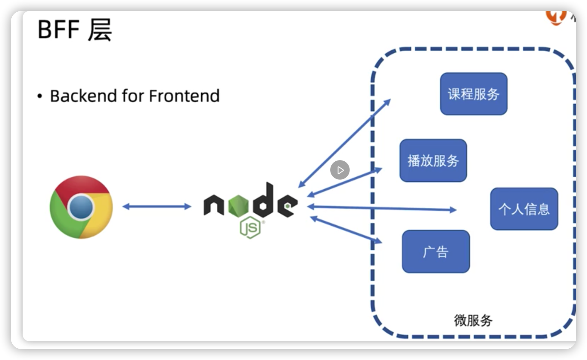

#### 什么是node.js

- 用js控制整个计算机
- 在node.js中写js和Chrome中写js基本是一样的，只不过node.js没有浏览器API,且多了node.js 的API


#### 用来做什么

- web服务-腾讯视频——搜索引擎的优化，首屏速度的优化
- 构建工作流-webpack
- 开发工具-vscode
- 游戏-wayward——利用js的灵活性提供给外部扩展
- 客户端应用-twitch——可以复用现有网站工程搭建客户端


#### BFF层



- 对客户端提供http服务
- 使用后端RPC服务


#### Node.js的全局变量

[Node.js 全局对象](https://www.runoob.com/nodejs/nodejs-global-object.html)


#### 石头剪刀布游戏

```js
// 获取用户输入的命令，然后和程序随机生成的剪刀石头布进行对比
const playerAction = process.argv[process.argv.length - 1];
...
```


#### commonJS规范

1. 通过export导出的的变量和require的变量是同一个

   ```js
   // lib.js
   exports.geekbang = { 'hello': 'haha' }
   exports.hello = 'world'
   // index.js
   var lib = require('./lib')
   lib.add = 'test';
   console.log(lib); // { hello, 'world', geekbang: {'hello': 'haha', 'add': 'test'} }
   
   ```

   

2. 对module.exports赋值，exports对象就不再是外面require所得到的结果了，但本文件内exports变量依然存在

- 上述现象出现的原因，可以通过webpack打包得出，执行`webpack --devtool=inline-source-map --mode=development --target=node ./index.js`

  1. `Index.js`函数调用了`__webpack_require__("./lib.js")`方法，`__webpack_require__`方法内创建了`module`对象，并执行方法`__webpack_modules__[moduleId](module, module.exports, __webpack_require__);`，最后抛出`module.exports`给`require`接收
  2. `__webpack_modules__["./lib.js"]`即调用`lib.js`打包后的函数，向 其传入`module`和`module.exports`，所以当`exports.xxx = 'xxx'`时，只是向了`__webpack_require__`创建的`module`对象的`export`里添加了属性；而当直接修改`module.exports = {}`;则是修改了`module.exports`的指向，之前的`exports.xxx`自然不起作用

  ```js
  // index.js模块
  (() => {
  console.log('start require');
  var lib = __webpack_require__(/*! ./lib */ "./lib.js")
  
  console.log('end require', lib);
    ...
  })();
    
    
  // require方法，传入moduleId，其实是路径
  function __webpack_require__(moduleId) {
  ...
  /******/ 		var module = __webpack_module_cache__[moduleId] = {
  /******/ 			// no module.id needed
  /******/ 			// no module.loaded needed
  /******/ 			exports: {} // 当模块没有exports时，require得到的对象
  /******/ 		};
  /******/ 	
  /******/ 		// Execute the module function
    					// 传入module和module.exports，所以当exports.xxx = 'xxx'时，只是向了module.export里添加了属性，当直接修改module.exports = {};则是修改了module.exports的指向，之前的exports.xxx自然不起作用
  /******/ 		__webpack_modules__[moduleId](module, module.exports, __webpack_require__);
  /******/ 	
  /******/ 		// Return the exports of the module
  /******/ 		return module.exports;
  /******/ 	}
    
    
  
  var __webpack_modules__ = ({
  //lib.js模块
      "./lib.js":((module, exports) => {
  
      console.log('this is module');
  
      exports.geekbang = { 'hello': 'haha' }
  
      exports.tencent = function () {
          console.log('good')
      }
  
      module.exports = function () {
          console.log('hello geekbang');
      }
    });
  });  
  ```

  