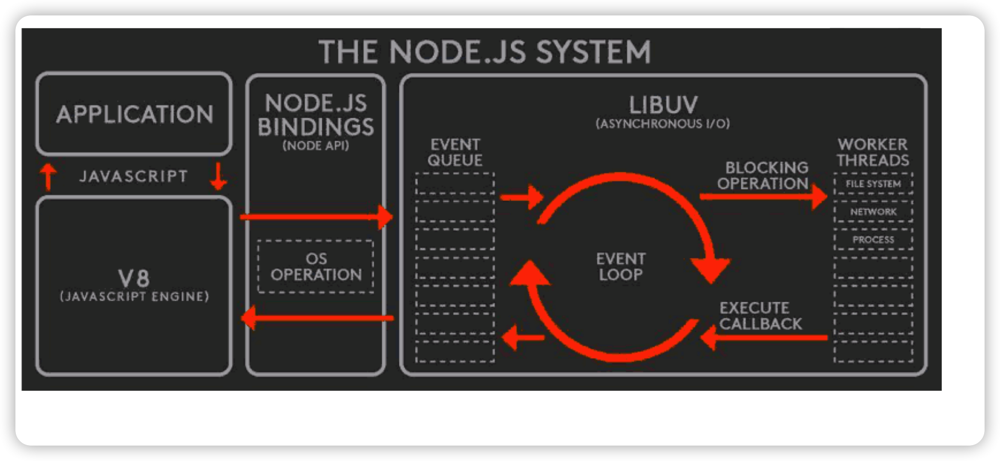
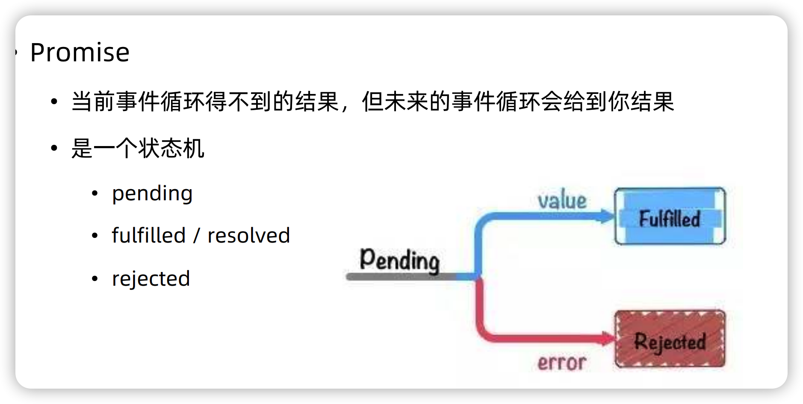

### npm

- npm是node.js的包管理工具，包是别人写的node.js模块

[Node文档地址](https://nodejs.org/dist/latest-v16.x/docs/api/)


### Node.js的非阻塞I/0

- I/O即input/output，系统的输入和输出
- 阻塞 I/O 和非阻塞 I/O 的区别就在于**系统接收输入再到输出期间，能不能接收其他输入。**

- 如何判断是非阻塞I/O
  - 确定一个进行 Input/Output 的系统。
  - 思考在 I/O 过程中，能不能进行其他 I/O。


```js
const glob = require('glob');

// 阻塞I/O
console.time('sync')
const result = glob.sync(__dirname + '/**/*')
console.timeEnd('sync')
console.log(result.length)


// 非阻塞I/O
console.time('async')
const result2 = glob(__dirname + '/**/*', function (err, result) {
    console.log(result.length)
})
console.timeEnd('async')
// IO完成之前还可以做别的事
console.log('hello geekbang')
```




### Node.js 异步编程 - callback

- 回调函数格式规范: 第一个参数是 error，后面的参数才是结果。 

```js
/**
 * try catch只能抓到一个调用堆栈内，即一个事件循环里的错误
 * 因此此处使用try catch异步事件抛出的错误是无效的。
 * 
 * error-first规范即是约定好如果该异步任务出错了
 * 错误会在第一个参数里回调出来。
 * 
 */
// try {
    interview(function (err, res) {
        if (err) {
            console.log('cry')
            return;
        }
        console.log('smile')
    })

// } catch (e) {
//     console.log('cry')
// }


// 事件循环机制，interview和setTimeout不在一个事件循环里
function interview(callback) {
    
    setTimeout(() => {
        if (Math.random() > 0.2) {
            callback(null, 'success')

        } else {
            // throw new Error('fail');
            callback(new Error('fail'))
        }

    }, 500)
}
```


### Promise

- 当前事件循环得不到的结果，但未来的事件循环会给到你结果

- 三个状态

  - pending

  - fulfilled/resolved

  - rejected

    

- .then 和 .catch
  - resolved 状态的 Promise 会回调后面的第一个 .then
  - rejected 状态的 Promise 会回调后面的第一个 .catch
  - 任何一个 rejected 状态且后面没有 .catch 的 Promise，都会造成 浏览器 /node 环境 的全局错误
  - .执行 then 和 catch 会返回一个新 Promise，该 Promise 最终状态根据 then 和 catch 的回调函数的执行结果决定
    - 如果回调函数最终是 throw，该 Promise 是 rejected 状态
    - 如果回调函数最终是 return，该 Promise 是 resolved 状态
    - 但如果回调函数最终 return 了一个 Promise ，该 Promise 会和回调函数 return 的 Promise 状态保持一致

- Promise.all的catch只能捕捉第一个报错的异步函数


### async/await

- async function 是 Promise 的语法糖封装

  ```js
  async function() {
    
  }()
  // =
  function () {
    return Promise((resolve, reject) => {
      
    })
  }()
  ```

  

- await 关键字可以等待后面紧跟着的promise的状态变更
- await 关键字可以以同步的写法获取 Promise 的执行结果
- try-catch 可以获取 await 所得到的错误