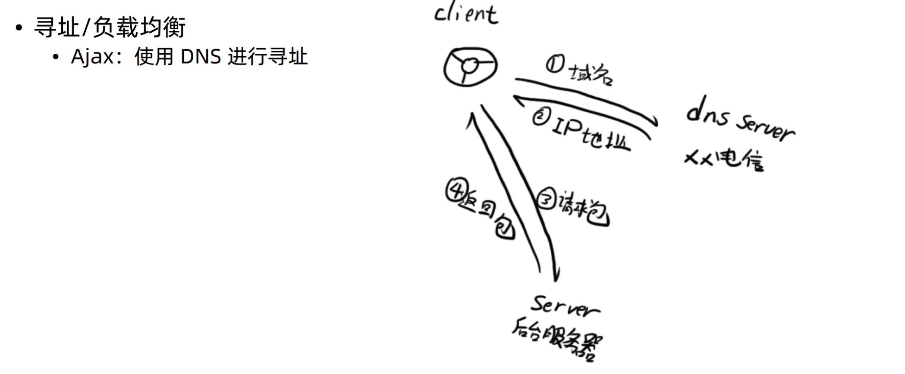
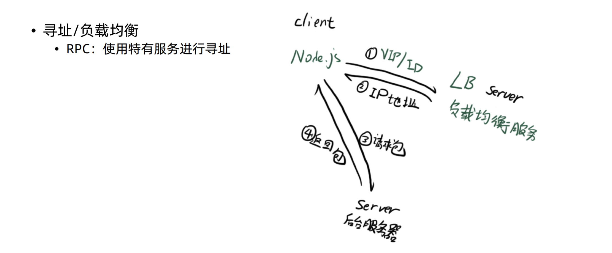
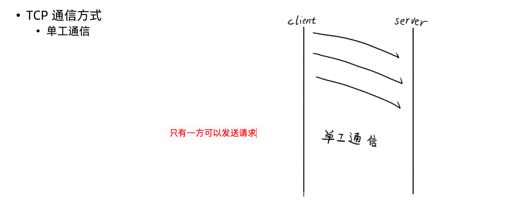
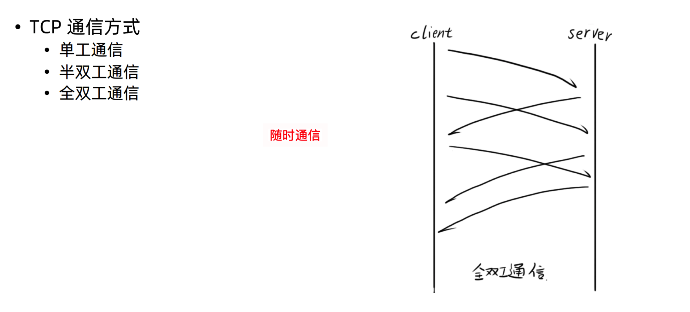
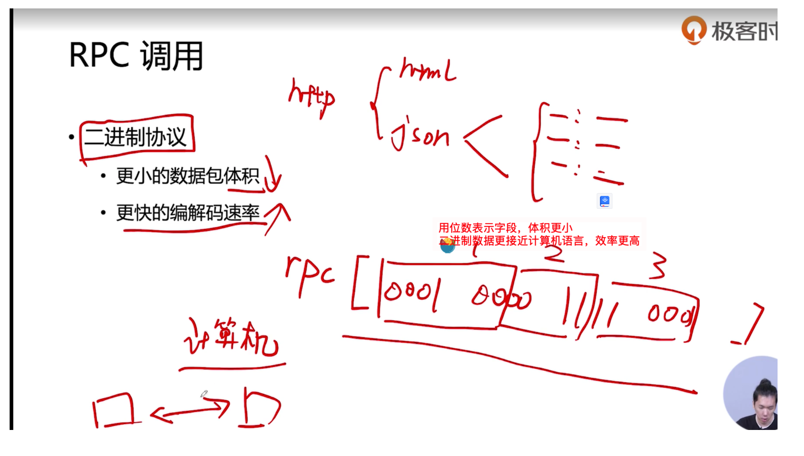

### RPC 调用

Remote Procedure Call（远程过程调用）,简单的理解是一个节点请求另一个节点提供的服务

- 与ajax比较的不同点
  - 不一定使用 DNS 作为寻址服务（rpc通信一般在内网里互相请求）
  - 应用层协议一般不使用 HTTP（rpc通信一般使用二进制协议，有性能优势）
  - 基于 TCP 或 UDP 协议（ajax基于TCP协议）


#### 寻址服务





#### tcp通信方式



轮番单工


全双工通信比半双工通信成本更高




#### 协议



### Node.js Buffer 编解码二进制数据包

```js
// 创建buffer，主要的两种方式
const buffer1 = Buffer.from('geekbang');
const buffer2 = Buffer.from([1, 2, 3, 4]);
const buffer3 = Buffer.alloc(20);

// 写
buffer2.writeInt8(12, 1);
console.log(buffer2);
buffer2.writeInt16LE(512, 2);
console.log(buffer2);
```

[protocol-buffers](https://www.npmjs.com/package/protocol-buffers),Google 研发的二进制协议编解码库

```js
const fs = require('fs');
const protobuf = require('protocol-buffers');

// 根据协议，编译出一个js逻辑对象，里面包含encode和decode函数

const schemas = protobuf(fs.readFileSync(`${__dirname}/test.proto`));
```


### Node.js net 模块

1. 单工通信通道搭建

   ```js
   // server.js
   const net = require('net');
   const server = net.createServer((socket)=> {
       // 读数据，监听data数据，回调函数的参数是buffer实例
       socket.on('data', function(buffer) {
           console.log(buffer, buffer.toString())
       })
   });
   
   // 创建rcp服务器
   server.listen(4000);
   // 先运行server.js,再运行client.js
   
   ```

   ```js
   //client.js
   const net = require('net');
   
   const socket = new net.Socket({});
   socket.connect({
       host: '127.0.0.1',
       port: 4000
   })
   // 写数据
   socket.write('good morning geekbang');
   ```

   

2. 半双工通信通道搭建

```js
// clien.js
...

// 随机获取课程id
let id = Math.floor(Math.random() * lessonids.length);

// 把编码请求包的逻辑封装为一个函数
function encode(index) {
    // 创建4位的buffer
    buffer = Buffer.alloc(4);
    // 写入课程id
    buffer.writeInt32BE(
        lessonids[index]
    );
    return buffer;
}

// 往服务器传数据
socket.write(encode(id));

// 监听server传回的数据
socket.on('data', (buffer) => {
    console.log(buffer.toString())

    // 接收到数据之后，按照半双工通信的逻辑，马上开始下一次请求
    id = Math.floor(Math.random() * lessonids.length);
    socket.write(encode(id));
})
```

```js
// server.js
// 创建tcp服务器
const server = net.createServer((socket) => {

    socket.on('data', function(buffer) {
        // 从传来的buffer里读出一个int32，与client.js写入的格式要一致
        const lessonid = buffer.readInt32BE();

        // 50毫秒后回写数据
        setTimeout(()=> {
            socket.write(
                Buffer.from(data[lessonid])
            );
        }, 50)
    })

});
```

3. 全双工的通信通道搭建

- 关键在于应用层协议需要有标记包号的字段，

- 处理以下情况，需要有标记包长的字段
  - 粘包（如当同时发送100个请求，tcp机制会自动把同时发送的包拼成一个大的包，一起发送给server端)
  - 不完整包


```js
// client.js
let seq = 0;

// 监听server传回的数据
socket.on('data', (buffer) => {
  	// 截取序号
    const seqBuffer = buffer.slice(0, 2);
    const titleBuffer = buffer.slice(2);
    console.log('返回课程',seqBuffer.readInt16BE(), titleBuffer.toString());
})

// 把编码请求包的逻辑封装为一个函数
function encode(index) {
    buffer = Buffer.alloc(6);
    buffer.writeInt16BE(seq);
    // 写入课程id
    buffer.writeInt32BE(lessonids[index],2);
    console.log('请求课程', seq, lessonids[index]);
    seq++;
    return buffer;
}
// client循环50毫秒发送一次请求，server随机1秒内返回数据，模拟双工通信
setInterval(() => {
    id = Math.floor(Math.random() * lessonids.length);
    socket.write(encode(id));
}, 50);

```

```js
// server.js
const server = net.createServer((socket) => {
    socket.on('data', function(buffer) {
        const seqBuffer = buffer.slice(0, 2);
        const lessonid = buffer.readInt32BE(2);
        console.log(seqBuffer);
        setTimeout(()=> {
            const resbuffer = Buffer.concat([
                seqBuffer,
                Buffer.from(data[lessonid])
            ]);
            socket.write(
                resbuffer
            );
        }, 10 + Math.random() * 1000)
    })

});
```

