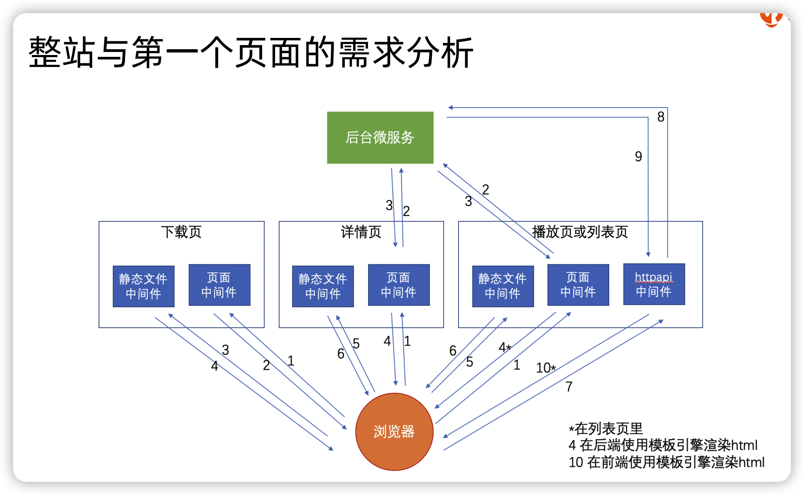

### 需求分析



### 首页

[koa-static](https://www.npmjs.com/package/koa-static) 可以把静态文件输出出去

```js
const static = require('koa-static');

// 把静态文件输出出去(如果文件路径匹配了/source/ 就会把里面的文件返回出去，)否则指向localhost:4000的请求都统一返回了根路径的内容
app.use(
	static(__dirname + '/source/')

);

```


### 使用 ES6 模板字符串实现模板引擎

1. 通过 vm 模块编译 JavaScript 形成函数

   ```js
   const vm = require('vm');
   console.log( vm.runInNewContext('`<h2>${user.name}</h2>`', {user}))
   ```

 2. xss 过滤、模板 helper 函数

    ```js
    console.log( vm.runInNewContext('`<h2>${_(user.name)}</h2>`', {
        user,
        _: function(markup) {
        if (!markup) return '';
        return String(markup)
            .replace(/&/g, '&amp;')
            .replace(/</g, '&lt;')
            .replace(/>/g, '&gt;')
            .replace(/'/g, '&#39;')
            .replace(/"/g, '&quot;')
        }
    }))
    ```

3. include 子模板

   ```js
   // 模板对象
   const templateMap = {
       templateA: '`<h2>${include("templateB")}</h2>`',
       templateB: '`<p>hahahaha</p>`'
   }
   
   // helper方法
   const context = {
       // 执行方法，获取模板字符串
       include(name) {
           return templateMap[name]()
       },
   
       // ssr过滤
       _: function(markup) {
          ...
       }
   }
   
   // 遍历对象，包装成函数
   Object.keys(templateMap).forEach(key=> {
       const temp = templateMap[key];
   
       templateMap[key] = vm.runInNewContext(`
           (function() {return ${temp}})
       `, context/*传入helper函数*/);
   })
   
   console.log(templateMap['templateA']());
   ```


### 极客时间课程详情页的需求实现

使用了[easy_sock](https://www.npmjs.com/package/easy_sock)快速开发基于tcp连接的二进制网络协议接口的nodejs模块

```js
// client/client.js
const EasySock = require('easy_sock');

const protobuf = require('protocol-buffers')
const fs = require('fs');
const schemas = protobuf(fs.readFileSync(`${__dirname}/detail.proto`));

const easySock = new EasySock({
    ip: '127.0.0.1',
    port: 4000,
    timeout: 500,
    keepAlive: true
})

easySock.encode = function(data, seq) {
    // 按照协议对请求包进行编码
    const body = schemas.ColumnRequest.encode(data);

    const head = Buffer.alloc(8);
    head.writeInt32BE(seq); // 序号
    head.writeInt32BE(body.length, 4); // 包长度

    return Buffer.concat([head, body])
}
// 对包进行解码
easySock.decode = function(buffer) {
    const seq = buffer.readInt32BE();
    const body = schemas.ColumnResponse.decode(buffer.slice(8));

    return {
        result: body,
        seq
    }
}
easySock.isReceiveComplete = function(buffer) {
    // 如果小于头的长度表示不完整
    if (buffer.length < 8) {
        return 0
    }
    const bodyLength = buffer.readInt32BE(4);

    // 包的长度是正确的
    if (buffer.length >= bodyLength + 8) {
        return bodyLength + 8

    } else {
        return 0
    }
}

module.exports = easySock;
```


```js
// client/index.js
const rpcClient = require('./client');
// template是一个方法，传入templatePath可以读取文件模板并编译
const template = require('./template');

const detailTemplate = template(__dirname + '/template/index.html');

app.use(async (ctx) => {
    if (!ctx.query.columnid) {
        ctx.status = 400;
        ctx.body = 'invalid columnid';
        return
    }

  // 发送请求
    const result = await new Promise((resolve, reject) => {
        rpcClient.write({
            columnid: ctx.query.columnid
        }, function (err, data) {
            err ? reject(err) : resolve(data)
        })
    })

    ctx.status = 200;
		// 渲染模板
    ctx.body = detailTemplate(result);
})

```