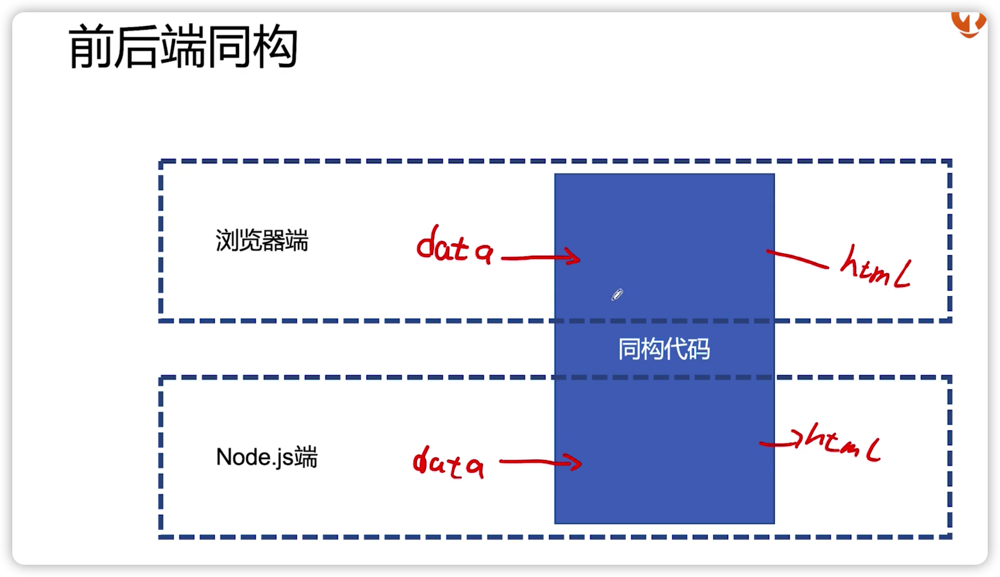
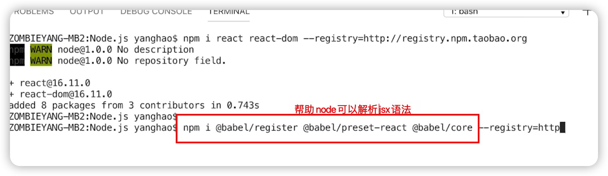

### GraphQL

[GraphQL](https://www.npmjs.com/package/graphql)

```js
// query.js
var { graphql, buildSchema } = require('graphql');

// Construct a schema, using GraphQL schema language
var schema = buildSchema(`
  type Query {
    hello: String
  }
`);

// The root provides a resolver function for each API endpoint
var root = {
    hello: () => {
        return 'Hello world!';
    },
};

module.exports = function(query) {
    console.log(query)
    // Run the GraphQL query '{ hello }' and print out the response
    return graphql({schema: schema, source: '{ hello }', rootValue: root}).then((response) => {
        return response
    });
}

```

```js
// index.js
const query = require('./query');

query('{ hello }').then(res=> {
    console.log(res);
})
```


[koa-graphql](https://www.npmjs.com/package/koa-graphql)

通过访问http://localhost:3000/?query={comment{name}}可以得到返回

```js
// index.js
const app = new (require('koa'));
// https://stackoverflow.com/questions/65517979/expressgraphql-is-not-a-function
const {graphqlHTTP} = require('koa-graphql');


app.use(
    graphqlHTTP({
        schema: require('./schema')
    })
)

app.listen(3000);
```

```js
// schema.js
const { graphql, buildSchema } = require('graphql');

const schema = buildSchema(`
    type Comment {
        id: Int
        avatar: String
        name: String
        isTop: Boolean
        content: String
        publishDate: String
        commentNum: Int
        praiseNum: Int
    }
    type Query {
        comment: [Comment]
    }
`)

schema.getQueryType().getFields().comment.resolve = () => {
    return [{
        id: 1,
        avatar: "https://static001.geekbang.org/account/avatar/00/0f/52/62/1b3ebed5.jpg",
        name: "僵尸浩",
        isTop: true,
        content: "哈哈哈哈",
        publishDate: "今天",
        commentNum: 10,
        praiseNum: 5
    }]
}

module.exports = schema;
```


### 极客时间课程播放页的需求实现

首先实现点赞功能

```js
// schema.js

// 在schema中加上操作，Mutation
// praise传入id作为参数，并返回一个数字
const schema = buildSchema(`
    ...
    type Mutation {
        praise(id: Int): Int
    }
`)

// 处理Mutation
// 点赞功能是post请求，id在第二个参数里
schema.getMutationType().getFields().praise.resolve = (args0, { id }) => {
    mockDatabase[id].praiseNum++;

    return mockDatabase[id].praiseNum
}
```

```js
// server.js

// 访问/api则调用graphql
app.use(
    // 给koa-graphql传一个graphql的协议文件，就会自动帮你生成graphql-api
    mount('/api', graphqlHTTP({
        schema: require('./schema')
    }))
    
)

// 处理静态资源
app.use(
    mount('/static', static(`${__dirname}/source/static`))
)

// 返回页面
app.use(
    mount('/', async (ctx) => {
        ctx.status = 200;
        ctx.body = fs.readFileSync(`${__dirname}/source/index.htm`, 'utf-8')
    })
)

// module.exports = app;
app.listen(3000)
```


```js
// index.html

// 点赞请求
fetch("./api", {
    method: "POST",
    headers: {
      'content-type': 'application/json'
    },
    body: JSON.stringify({
      "query": "mutation { praise(id: " + $bindtarget.getAttribute("data-id") + ") }"
    })
  }).then(res => res.json())
    .then(res => {
      $bindtarget.querySelector('span').innerHTML = res.data.praise
    })
}

// 列表数据展示
fetch('./api?query={comment{id,avatar,name,isTop,content,publishDate,commentNum,praiseNum}}')

              .then(res => res.json())
              .then(res => {
                document.getElementById("comment_list_num").innerHTML = `(${res.data.comment.length})`;
                document.getElementById('comment_list').innerHTML = res.data.comment.map(item => {
                  return `
                      <li class="reJj6Thl_0">
                        <div class="_2CG0SquK_0">
                          <div class="_304R4gla_0">
                            <div>
                              <div class="_18Dng5rT_0"><span>${item.name}</span> ${item.isTop ? '<span class="_1bkbsnjg_0">置顶</span>' : ''}</div>
                              <div class="_1H1Z49Dr_0">${item.publishDate}</div>
                              })
                              ...
```


### 用vue/react进行服务端渲染





[这是一个用于 生产环境的 React 框架](https://www.nextjs.cn/)


### 极客时间课程列表页的需求实现

1. 抽离列表数据模板，node填充数据

启动分别执行server.js和backend.js

```js
// server.js
// 引入babel，编译jsx语法
require('@babel/register')({
    presets: ['@babel/preset-react']
});
require('./node')
```

找到列表部分的代码，并替换

```html
// node/index.htm
<div id="reactapp">
  ${reactString}
</div> 
```

node部分，处理数据

```js
// node/app.jsx
const React = require('react')
const Container = require('../component/container.jsx')

module.exports = function (reactData) {
    return <Container
        columns={reactData}
        filt={() => { }}
        sort={() => { }}
    />
}
```


```js

const getData = require('./get-data')
const App = require('./app.jsx')
const template = require('./template')(__dirname + '/index.htm')

// 排序接口
app.use(mount('/data', async (ctx) => {
    ctx.body = await getData(+(ctx.query.sort || 0), +(ctx.query.filt || 0));
}));

app.use(async (ctx) => {
    ctx.status = 200;
    const filtType = +(ctx.query.filt || 0)
    const sortType = +(ctx.query.sort || 0);
    // 获取数据
    const reactData = await getData(sortType, filtType);
    // 使用renderToString获取渲染好的字符串
    ctx.body = template({
        reactString: ReactDOMServer.renderToString(
            App(reactData)
        ),
        // 存储在windows中，作为客户端模板渲染时的初始数据
        reactData,
        filtType,
        sortType
    })
})

app.listen(3000)

```

2. 客户端代码，用户点击排序，重新渲染列表

```js
// browser/webpack.config.js
// webpack配置，编译入口文件并输出，可以通过script标签引入
module.exports = {
    entry: __dirname + '/index.jsx',
    output: {
        filename: 'main.js',
        path: __dirname + '/../node/source/'
    },
   
}
```

```html
// node/index.htm
<script>
  <!--      将node获取的数据作为初始数据-->
  window.reactInitData = ${reactData ? JSON.stringify(reactData) : ''};
  window.reactInitFiltType = ${filtType};
  window.reactInitSortType = ${sortType}
</script>
<script src="./static/main.js"></script>
```


```js
// browser/index.jsx
class App extends React.Component {

    constructor() {
        super();
        this.state = {
            columns: reactInitData,
            filtType: reactInitFiltType,
            sortType: reactInitSortType
        }
    }

    render() {
        return (
            <Container
                columns={this.state.columns}
                {/*根据点击请求接口并重新渲染模板*/}
                filt={(filtType) => {
                    fetch(`./data?sort=${this.state.sortType}&filt=${filtType}`)
                        .then(res => res.json())
                        .then(json => {
                            this.setState({
                                columns: json,
                                filtType: filtType
                            })
                        })
                }}
                sort={(sortType) => {
                    ...
                }}
            />
        )
    }
}
ReactDOM.render(
    <App />,
    document.getElementById('reactapp')
)

```