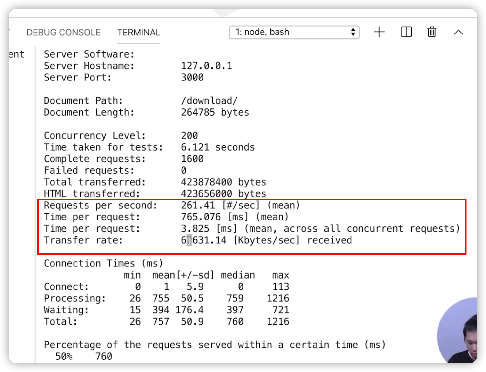
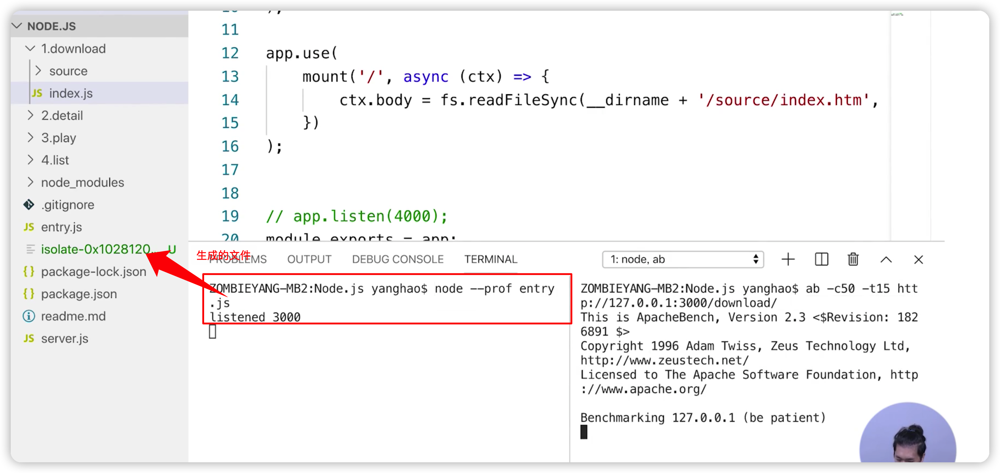
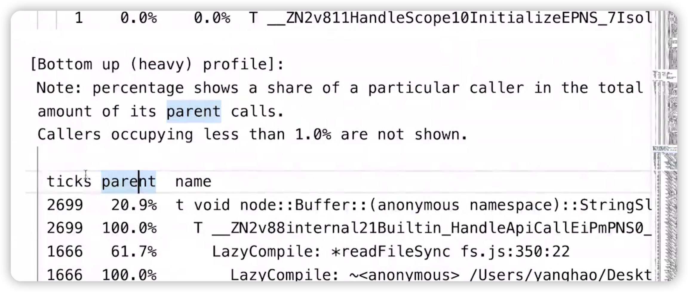
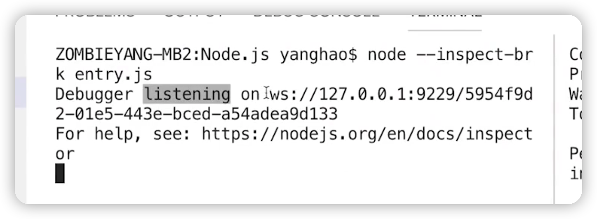
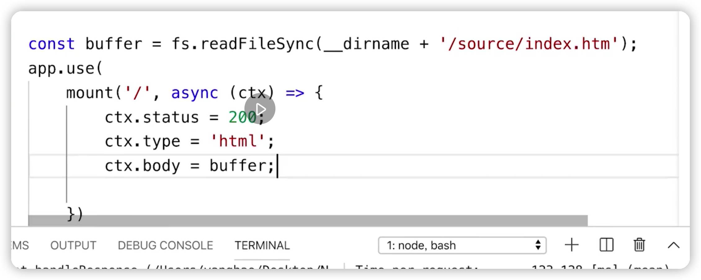
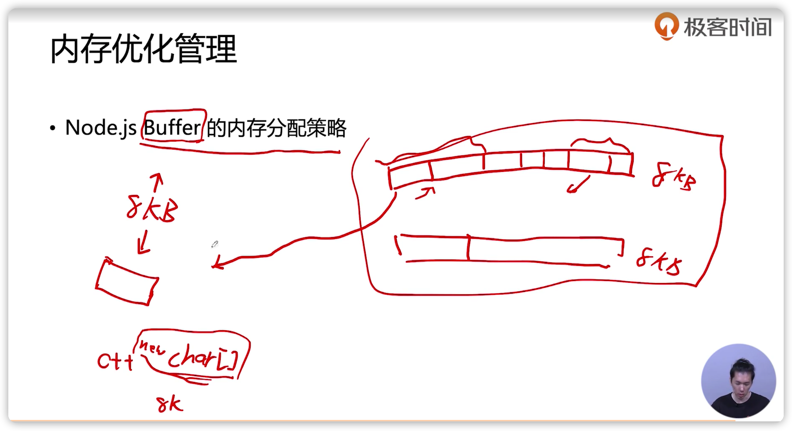

### HTTP 服务性能测试

1. ab
2. webbench


视频里使用的是[apache bench](http://testingpai.com/article/1595507309308)

#### 服务器性能指标

1. QPS ：每秒服务器能承载的请求量

2. 吞吐量：每秒服务器能承载的数据量的交互

   

如果吞吐量和网卡的带宽差不多大，就可以定位是网卡的原因


#### 找到性能瓶颈

1. top：监控计算机的CPU和内存使用情况。在压测的时候同时跑top，可以看到CPU和内存占用情况
2. iostat：检测各个io设备的带宽，如硬盘的带宽。
3. 后端服务器：后端承载qps可能成为瓶颈


### **Node.js 性能分析工具**

#### 工具 

1. Node.js 自带 profile 

   ```js
   node --prof xx.js
   ```

   

   分析log文件，输入以下命令可以生成一个text文件

   ```js
   node --prof-process xx.log
   ```

   主要关注的地方，找到大头，然后看他的来源，对来源进行性能优化

   

2. Chrome devtool 

   

3. npm - [clinic](https://www.npmjs.com/package/clinic)


### JavaScript 代码性能优化

根据性能分析结果，优化下载页性能



1. 把文件读取抽离出来，避免重复执行
2. body 直接返回buffer类型，省去node从字符串转成buffer的操作，但需要设置类型和状态


1. 减少不必要的计算
   1. 把文件读取抽离出来，避免重复执行
   2. 小图片变成大图片，减少请求
2. 空间换时间
   1. 将计算缓存出来，做提前计算，本视频中两点都属于空间换时间
   2. 


### 内存优化管理

- 新生代 ：新创建的js变量会先进入新生代，在快要满的时候，会进行一次垃圾回收，大部分就会被回收。如果有变量多次未被回收，就会进入老生代

  - 容量小，垃圾回收更快

-  老生代：容量更大，垃圾回收频率低，存放不怎么可能被释放的内存

  - 容量大，垃圾回收更慢

    

可能出现的问题

1. 内存占用越少，遍历的更快，垃圾回收更快
2. 内存泄漏导致老生代占用大，垃圾回收慢

因此，

1. 减少内存使用，也是提高服务性能的手段。

   1.  Node.js Buffer 的内存分配策略 

   如果大于8k的buffer，node.js会new一个char[]数组来存放

   如果大于8k的buffer，node.js会申请一个8kb的空间来存放变量，直到存满，再申请下一个8kb大的空间来存放。如果有buffer较大放不下当前的k8大小的空间，就会申请新的空间存放，将多余的空间留给合适大小的buffer

   

   ——由此得出：节省内存的最好方式就是：使用池

   

2. 如果有内存泄漏，会导致服务性能大大降低。


### Node.js C++ 插件

[Node-gyp](https://www.npmjs.com/package/node-gyp)

