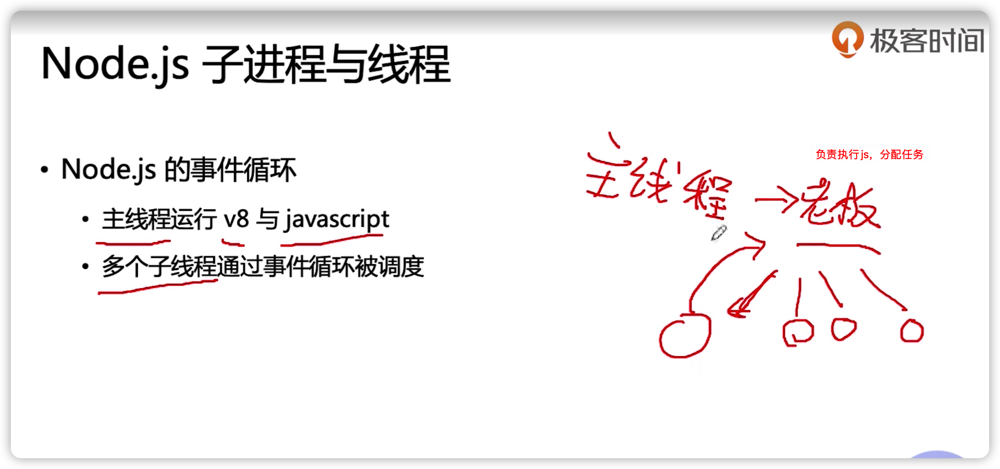

### Node.js 子进程与线程

进程

- 操作系统挂载运行程序的单元 
-  拥有一些独立的资源，如内存等
  - 比如启动一个node.js程序

线程 

- 进行运算调度的单元 
-  进程内的线程共享进程内的资源


- 进程类似“公司” 

- 线程类似公司的“职员”



```js
// master.js
const cp  = require('child_process');

const child_process = cp.fork(__dirname + '/child.js');

child_process.send('haha');

child_process.on('message', (str) => {
    console.log('parent', str);
})
```

```js
// child.js
process.on('message', (str) => {
    console.log('child', str);

    process.send('hehe')
})
```


### Node.js cluster 模块

主进程启动多个子进程，由主进程轮流分发请求，子进程代为处理

```js
const cluster  = require('cluster');
const os = require('os'); // 获取内核数

// 如果是主进程
if (cluster.isPrimary) {
    for (let i = 0;i<os.cpus(),length;i++) {
        // 开启进程
        cluster.fork();
    }
} else {
    require('./index')
}
```